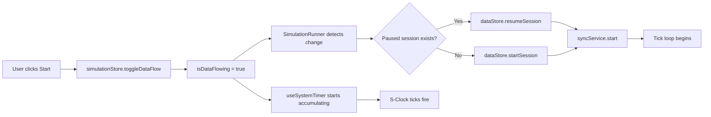
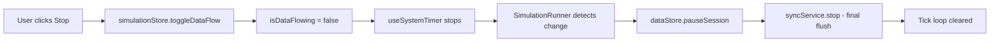
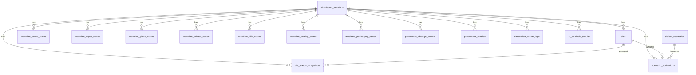

# Virtual Factory — Simulation Architecture

> **Audience:** Future developers (KLO and team).  
> **Purpose:** Single-source-of-truth document explaining how the simulation runs, how data flows, and how every piece connects.

---

## Table of Contents

1. [High-Level Overview](#1-high-level-overview)
2. [Module Map](#2-module-map)
3. [Clock Architecture (S-Clock & P-Clock)](#3-clock-architecture-s-clock--p-clock)
4. [State Management (Zustand Stores)](#4-state-management-zustand-stores)
5. [Simulation Logic & Tile Lifecycle](#5-simulation-logic--tile-lifecycle)
6. [Demo Settings & Parameter Modification](#6-demo-settings--parameter-modification)
7. [Start / Stop / Reset Mechanism](#7-start--stop--reset-mechanism)
8. [Alarm Log Generation](#8-alarm-log-generation)
9. [KPI Calculation Pipeline](#9-kpi-calculation-pipeline)
10. [Data Synchronization (Local → Supabase)](#10-data-synchronization-local--supabase)
11. [Database Structures](#11-database-structures)
12. [Telemetry (Real-Time Dashboard Feed)](#12-telemetry-real-time-dashboard-feed)
13. [Key Design Decisions & Conventions](#13-key-design-decisions--conventions)

---

## 1. High-Level Overview

The Virtual Factory is a **3D browser-based simulation** of a ceramic tile production line with 7 stations:

| #   | Station       | What it does (real world)        |
| --- | ------------- | -------------------------------- |
| 1   | **Press**     | Hydraulic pressing of raw powder |
| 2   | **Dryer**     | Hot-air moisture removal         |
| 3   | **Glaze**     | Spray-coating glaze slurry       |
| 4   | **Printer**   | Digital inkjet pattern printing  |
| 5   | **Kiln**      | High-temperature firing          |
| 6   | **Sorting**   | Camera-based quality inspection  |
| 7   | **Packaging** | Boxing and palletizing           |

Tiles are created at the Press, travel along a conveyor belt through each station, and are either shipped (completed) or scrapped (waste). The simulation generates realistic machine parameters, defects, KPIs, and alarms — all persisted to **Supabase** for AI analysis and dashboards.

### Architectural Layers

```
┌──────────────────────────────────────────────────────────┐
│                   React UI Components                    │
│   Header · ControlPanel · KPIContainer · AlarmLog · 3D   │
├──────────────────────────────────────────────────────────┤
│                    React Hooks Layer                      │
│  useKPISync · useAlarmMonitor · useSimulation · etc.      │
├──────────────────────────────────────────────────────────┤
│                 Zustand State Stores                      │
│  simulationStore · simulationDataStore · kpiStore · etc.  │
├──────────────────────────────────────────────────────────┤
│                   Services Layer                          │
│  syncService · telemetryStore · supabaseClient            │
├──────────────────────────────────────────────────────────┤
│                   Supabase (Cloud DB)                     │
│  17 tables · RLS enabled · batch upsert                   │
└──────────────────────────────────────────────────────────┘
```

---

## 2. Module Map

### Core Configuration

| File                        | Purpose                                                                                                                                                   |
| --------------------------- | --------------------------------------------------------------------------------------------------------------------------------------------------------- |
| `src/lib/params.ts`         | **Central configuration hub** — ALL constants, initial values, thresholds, colors, dimensions, magic numbers. Nothing is hardcoded elsewhere. ~979 lines. |
| `src/lib/supabaseClient.ts` | Creates the Supabase client (null-safe if env vars missing).                                                                                              |
| `src/store/types.ts`        | All TypeScript record types mirroring Supabase tables (~825 lines).                                                                                       |

### Zustand Stores

| Store                 | File                               | Role                                                                                                                                                 |
| --------------------- | ---------------------------------- | ---------------------------------------------------------------------------------------------------------------------------------------------------- |
| `simulationStore`     | `src/store/simulationStore.ts`     | **MASTER** — S-Clock, P-Clock, conveyor status, station matrix, fault tracking. Independent of Supabase.                                             |
| `simulationDataStore` | `src/store/simulationDataStore.ts` | **Data Layer** — Machine states, tiles, snapshots, parameter changes, scenarios, metrics, alarm logs. Queues records for Supabase sync. ~1500 lines. |
| `kpiStore`            | `src/store/kpiStore.ts`            | **KPI values** — OEE, FTQ, Scrap, Energy, Gas, CO₂, defect heatmap data. Passive (written to by `useKPISync`).                                       |
| `uiStore`             | `src/store/uiStore.ts`             | **UI state** — Panel visibility toggles (passport, heatmap, control panel, demo settings, alarm log, KPI panel).                                     |
| `telemetryStore`      | `src/store/telemetryStore.ts`      | **Telemetry push** — Periodically upserts station + KPI data to the `telemetry` table with retry logic.                                              |

### Hooks

| Hook              | File                                 | Role                                                                                                                  |
| ----------------- | ------------------------------------ | --------------------------------------------------------------------------------------------------------------------- |
| `useSystemTimer`  | `src/system-timer/useSystemTimer.ts` | **Heartbeat** — Drives the entire simulation via R3F's `useFrame`. Emits S-Clock ticks.                               |
| `useKPISync`      | `src/hooks/useKPISync.ts`            | **KPI calculator** — Subscribes to S-Clock, computes all KPIs, writes to `kpiStore`.                                  |
| `useAlarmMonitor` | `src/hooks/useAlarmMonitor.ts`       | **Alarm generator** — Monitors KPI thresholds and station faults, dual-writes alarms.                                 |
| `useSimulation`   | `src/hooks/useSimulation.ts`         | **UI hooks** — `useMachineState`, `useConveyorState`, `useSimulationMetrics`, etc. Optimized re-render subscriptions. |
| `useFactoryReset` | `src/hooks/useFactoryReset.ts`       | **Multi-store reset** — Coordinates resetting all stores in correct order.                                            |

### Services & Orchestration

| Module              | File                                      | Role                                                                                                                        |
| ------------------- | ----------------------------------------- | --------------------------------------------------------------------------------------------------------------------------- |
| `SimulationRunner`  | `src/components/SimulationRunner.tsx`     | **Orchestrator** — Logic-only component. Manages data-store tick loop, sync service lifecycle, and session auto-management. |
| `syncService`       | `src/services/syncService.ts`             | **Batch sync engine** — Periodically flushes unsynced records from `simulationDataStore` to Supabase.                       |
| `DemoSettingsPanel` | `src/components/ui/DemoSettingsPanel.tsx` | **Parameter editor** — Full-screen UI for modifying machine parameters and drift limits.                                    |

---

## 3. Clock Architecture (S-Clock & P-Clock)

The simulation runs on a **dual-clock system**:

### S-Clock (Simulation Clock)

- **What:** The master time-keeper. Ticks continuously whenever `isDataFlowing === true`.
- **Default period:** `500ms` (configurable via `DEFAULT_S_CLOCK_PERIOD` in `params.ts`).
- **Driver:** `useSystemTimer` accumulates real time (scaled by `conveyorSpeed`) via R3F's `useFrame` and calls `advanceSClock()` when accumulated ≥ period.
- **Lag handling:** Multiple ticks can fire per frame to catch up after lag spikes.
- **Important:** **S-Clock ticks even when the conveyor is jammed.** It tracks simulation time, not production time.

### P-Clock (Production Clock)

- **What:** A sub-clock gated by conveyor status. Ticks only when `conveyorStatus === 'running'` (not 'jammed' or 'stopped').
- **Ratio:** Every `PRODUCTION_TICK_RATIO` (default: 2) S-Clock ticks, one P-Clock tick fires.
- **Purpose:** Controls when tiles actually move, machines process, and production happens.
- **Where gated:** Inside `advanceSClock()` in `simulationStore.ts`.

### Timing Formula

```
Real Time (delta from useFrame)
    × conveyorSpeed (0.5–2.0)
    × 1000 (convert to ms)
    → Accumulate
    → When accumulator ≥ sClockPeriod → advanceSClock()
        → sClockCount++
        → if (sClockCount % PRODUCTION_TICK_RATIO === 0 && conveyor === 'running')
            → pClockCount++
            → advance station matrix
            → create/move tiles
```

### Jam Auto-Resume

If the conveyor stays jammed longer than `JAM_AUTO_RESUME_MS` (default: 3000ms), `useSystemTimer` automatically resumes it.

---

## 4. State Management (Zustand Stores)

### 4.1 simulationStore (MASTER)

The **single source of truth** for the simulation's real-time state. Independent of Supabase.

**Key state fields:**

| Field              | Type                                 | Purpose                                                                        |
| ------------------ | ------------------------------------ | ------------------------------------------------------------------------------ |
| `isDataFlowing`    | `boolean`                            | Master on/off for the entire simulation                                        |
| `conveyorStatus`   | `'running' \| 'stopped' \| 'jammed'` | Current physical state of the conveyor belt                                    |
| `conveyorSpeed`    | `number`                             | Speed multiplier (0.5–2.0)                                                     |
| `sClockPeriod`     | `number`                             | S-Clock tick interval in ms                                                    |
| `sClockCount`      | `number`                             | Total S-Clock ticks since start                                                |
| `pClockCount`      | `number`                             | Total P-Clock ticks since start                                                |
| `statusMatrix`     | `(string \| null)[][]`               | 7×1 grid of tile IDs at each station                                           |
| `shipmentCount`    | `number`                             | Tiles that reached the end (shipped)                                           |
| `wasteCount`       | `number`                             | Tiles that were scrapped                                                       |
| `faultCount`       | `number`                             | Total fault events                                                             |
| `sessionId`        | `string`                             | Unique ID for current simulation session                                       |
| `alarmLog`         | `AlarmEntry[]`                       | Local-only alarm display buffer                                                |
| `partPositionsRef` | `MutableRefObject`                   | Imperative ref for per-frame tile position updates (never triggers re-renders) |
| `partIdsRef`       | `MutableRefObject`                   | Imperative ref for tile ID tracking                                            |

**Key actions:**

- `toggleDataFlow()` — Start/stop the simulation
- `advanceSClock()` — Core tick logic (S-Clock + conditional P-Clock + matrix advancement)
- `setConveyorStatus()` — Change conveyor state
- `addAlarm()` — Push alarm to local display buffer
- `resetSimulation()` — Full state reset with new session ID

### 4.2 simulationDataStore (Data Layer)

The **Supabase-bound data layer**. Additive to the MASTER store — records everything for persistence.

**Data collections:**

| Collection         | Local Type                              | Supabase Table                |
| ------------------ | --------------------------------------- | ----------------------------- |
| `session`          | `SimulationSession`                     | `simulation_sessions`         |
| `machineStates`    | `MachineStateTables` (7 Maps)           | `machine_*_states` (7 tables) |
| `currentParams`    | `CurrentMachineParams`                  | N/A (live state only)         |
| `tiles`            | `Map<string, TileRecord>`               | `tiles`                       |
| `tileSnapshots`    | `Map<string, TileSnapshotRecord[]>`     | `tile_station_snapshots`      |
| `parameterChanges` | `ParameterChangeRecord[]`               | `parameter_change_events`     |
| `activeScenarios`  | `Map<string, ScenarioActivationRecord>` | `scenario_activations`        |
| `metricsHistory`   | `ProductionMetricsRecord[]`             | `production_metrics`          |
| `alarmLogs`        | `AlarmLogRecord[]`                      | `simulation_alarm_logs`       |

**Sync tracking:** Every record has a `synced: boolean` flag. Unsynced records are tracked in `unsyncedRecords` and flushed by `syncService`.

**Session lifecycle actions:**

- `startSession(name, description)` — Creates new session, starts tick counters
- `pauseSession()` — Marks session as paused
- `resumeSession()` — Resumes from paused state
- `endSession()` — Marks session as completed, records final tick values

### 4.3 kpiStore (KPI Values)

Passive store — holds data but does NOT compute. Updated by `useKPISync`.

| Field        | Purpose                                                      |
| ------------ | ------------------------------------------------------------ |
| `kpis`       | Array of 6 KPI objects (OEE, FTQ, Scrap, Energy, Gas, CO₂)   |
| `defects`    | Array of 8 defect types with percentage values (for heatmap) |
| `kpiHistory` | Rolling history for trend calculation                        |

### 4.4 telemetryStore (Dashboard Feed)

Side-effect-only store that pushes data to the `telemetry` table.

- Runs on a `setInterval` at `TELEMETRY_INTERVAL_MS`
- Upserts per-station rows + one global `factory` summary row
- Includes exponential backoff retry (1s, 2s, 4s) on failure
- Null-safe (gracefully skips if Supabase not configured)

---

## 5. Simulation Logic & Tile Lifecycle

### How Tiles Move

1. **Creation (Press station):** On P-Clock tick, if Press slot is empty → `createTile()` generates a new `TileRecord` with a sequential `tile_number`.
2. **Station Matrix:** `statusMatrix[stationIndex][0]` holds the tile ID currently at each station. On P-Clock tick, tiles shift right: `matrix[i] = matrix[i-1]`
3. **Conveyor Positions:** `partPositionsRef` (imperative ref) tracks the continuous 3D position of each tile on the conveyor between stations. Updated every frame by R3F's `useFrame`.
4. **Snapshots (Künye/Tile Passport):** When a tile enters a station, `recordTileSnapshot()` captures the machine state at that moment → creates a `TileSnapshotRecord`.
5. **Completion:** When a tile exits the last station (Packaging), it's either shipped (status → `completed`, `shipmentCount++`) or scrapped (status → `scrapped_at_*`, `wasteCount++`).

### Station Occupancy Matrix

```
Station Index:   0        1       2        3         4       5         6
Station Name:  PRESS → DRYER → GLAZE → PRINTER → KILN → SORTING → PACKAGING

statusMatrix: [ [tileA], [tileB], [tileC], [null], [tileD], [tileE], [null] ]
```

On each P-Clock tick, `advanceSClock()` shifts tiles one station to the right. Station gaps are controlled by `STATION_INTERVAL`.

### Defect Scenarios

Pre-defined in the `defect_scenarios` Supabase table. Each scenario has:

- **Trigger conditions:** Parameter thresholds that activate the scenario (e.g., `pressure_bar > 420`)
- **Affected stations:** Which downstream stations are impacted
- **Defect types:** Which defects are likely
- **Scrap/downgrade probabilities**

`simulationDataStore.checkAndActivateScenarios()` evaluates current parameters against all active scenarios on each tick.

---

## 6. Demo Settings & Parameter Modification

### DemoSettingsPanel (`DemoSettingsPanel.tsx`)

A full-screen overlay (glassmorphism dark theme) that allows modifying machine parameters during a running simulation.

**UI Structure:**

```
┌──────────────────────────────────────────────────┐
│  Demo Settings                              [×]  │
├─────────┬────────────────────────────────────────┤
│ [Press] │  Parameter │ Range │ Unit │ Value │ Δ% │
│  Dryer  │  ───────── │ ───── │ ──── │ ───── │ ─  │
│  Glaze  │  pressure  │280-450│ bar  │ 340.0 │ 5  │
│ Printer │  cycle_time│ 4-8   │ sec  │  5.5  │ 3  │
│  Kiln   │  ...       │       │      │       │    │
│ Sorting │            │       │      │       │    │
│Packaging│            │       │      │       │    │
│         │            │       │      │       │    │
│[Commit] │            │       │      │       │    │
│  [Ref]  │            │       │      │       │    │
└─────────┴────────────────────────────────────────┘
```

### Two Editable Columns

1. **Value** — The current parameter value. Editing this calls `updateParameter(station, paramKey, numValue, 'step', 'operator')` which:
   - Updates the live `currentParams` in `simulationDataStore`
   - Creates a `ParameterChangeRecord` for audit trail
   - Marks the record as unsynced for Supabase

2. **Δ % (Variation/Drift Limit)** — Controls how much a parameter can drift from its set value during simulation. Editing this calls `updateDriftLimit(station, paramKey, driftLimit)`.

### Buttons

- **Commit** — Refreshes displayed values from live simulation state (in case parameters drifted since panel opened)
- **Reference** — Resets all parameters to factory defaults via `resetToFactoryDefaults()`

### Color Coding

- **Green** border → Value matches reference (factory default)
- **Orange** border → Value has been modified from reference

### Machine List

Defined in `params.ts` as `DEMO_SETTINGS_MACHINES`:

```typescript
{ key: 'press',     label: 'Press',     color: '#64748b' }
{ key: 'dryer',     label: 'Dryer',     color: '#f59e0b' }
{ key: 'glaze',     label: 'Glaze',     color: '#3b82f6' }
{ key: 'printer',   label: 'Printer',   color: '#8b5cf6' }
{ key: 'kiln',      label: 'Kiln',      color: '#ef4444' }
{ key: 'sorting',   label: 'Sorting',   color: '#10b981' }
{ key: 'packaging', label: 'Packaging', color: '#06b6d4' }
{ key: 'general',   label: 'General',   color: '#6b7280' }
```

---

## 7. Start / Stop / Reset Mechanism

### Start (Toggle ON)



**What happens on start:**

1. `simulationStore.isDataFlowing` → `true`
2. `useSystemTimer` begins accumulating time and firing `advanceSClock()`
3. `SimulationRunner` detects the change → creates/resumes a data store session
4. `syncService.start()` begins periodic batch syncing to Supabase
5. A `setInterval` tick loop calls `simulationDataStore.tick()` at `sClockPeriod` intervals

### Stop (Toggle OFF)



**What happens on stop:**

1. `simulationStore.isDataFlowing` → `false`
2. `useSystemTimer` resets accumulator to 0, stops ticking
3. `SimulationRunner` pauses the data store session (status → `'paused'`)
4. `syncService.stop()` performs a final sync flush, then clears the interval
5. Tick loop `clearInterval` stops data store ticking

### Full Factory Reset

Orchestrated by `useFactoryReset` hook — resets all stores in correct order:

```
1. dataStore.endSession()       → marks session as 'completed' in Supabase
2. syncService.stop()           → final flush of unsynced records
3. dataStore.resetDataStore()   → clears all local data collections
4. kpiStore.resetKPIs()         → resets OEE, FTQ, defects, history
5. uiStore.setState(...)        → closes all floating panels
6. simulationStore.resetSimulation() → resets clocks, counters, matrix, new sessionId
```

### Tab Close Protection

`SimulationRunner` registers a `beforeunload` handler that sends a `fetch(..., { keepalive: true })` PATCH request to mark the session as `'abandoned'` in Supabase. This survives page unload.

---

## 8. Alarm Log Generation

### Where Alarms Are Generated

**`useAlarmMonitor` hook** — subscribes to `simulationStore` and `kpiStore`, checks conditions every tick.

### Two Types of Alarm Triggers

#### 1. KPI Threshold Alarms

Checked on every S-Clock tick when `isDataFlowing === true`:

| Alarm Type      | Condition                       | Severity   |
| --------------- | ------------------------------- | ---------- |
| `oee_alert`     | OEE < `ALARM_OEE_CRITICAL`      | `critical` |
| `quality_alert` | FTQ < `ALARM_FTQ_WARNING`       | `warning`  |
| `scrap_alert`   | Scrap > `ALARM_SCRAP_CRITICAL`  | `critical` |
| `energy_alert`  | Energy > `ALARM_ENERGY_WARNING` | `warning`  |

Thresholds are defined in `params.ts`.

#### 2. Station Status Change Alarms

Triggered when a station's status changes:

| From → To                    | Alarm Type          | Severity   |
| ---------------------------- | ------------------- | ---------- |
| any → `error`                | `machine_error`     | `critical` |
| any → `warning`              | `machine_warning`   | `warning`  |
| `error`/`warning` → `normal` | `machine_recovered` | `info`     |

### Cooldown Mechanism

Each alarm type has a cooldown period (`ALARM_COOLDOWN_MS` in `params.ts`). After an alarm fires, the same type won't fire again until the cooldown expires. This prevents alarm flooding.

### Dual Write

Every alarm is written to **two places**:

```
maybeAlarm() fires
    │
    ├── simulationStore.addAlarm(...)     → Local UI display buffer
    │                                        (AlarmLog panel reads this)
    │
    └── simulationDataStore.recordAlarm(...)  → Supabase sync queue
                                                (synced by syncService)
```

---

## 9. KPI Calculation Pipeline

### Data Flow

```
useSystemTimer (R3F)
    → advanceSClock()
        → sClockCount++
            → useKPISync detects sClockCount change
                → Reads simulationStore + kpiStore
                → Calculates all KPIs
                → Writes results to kpiStore
                    → UI components re-render
```

### KPIs Computed

| KPI        | Formula / Source                                     | Unit |
| ---------- | ---------------------------------------------------- | ---- |
| **OEE**    | Availability × Performance × Quality                 | %    |
| **FTQ**    | shipped / (shipped + wasted)                         | %    |
| **Scrap**  | 1 - FTQ                                              | %    |
| **Energy** | Speed-dependent per-station kWh from `ENERGY_CONFIG` | kWh  |
| **Gas**    | Speed-dependent gas consumption                      | m³   |
| **CO₂**    | Derived from energy + gas                            | kg   |

### Trend Calculation

A rolling window of `KPI_TREND_WINDOW` S-Clock ticks. Current values are compared to the average of historical values to determine trend direction (↑, ↓, →).

### Defect Heatmap

Defect percentages are randomized with jitter on each P-Clock tick for visual dynamism. Uses base values from `INITIAL_DEFECTS` in `params.ts`.

---

## 10. Data Synchronization (Local → Supabase)

### Architecture Overview

```
simulationDataStore (In-Memory)
    │
    │  unsyncedRecords { machineStates, tiles, snapshots, ... }
    │
    ├── syncService.start() → setInterval(sync, SYNC_INTERVAL_MS)
    │
    │   sync() ─── Step 1: Upsert session ──────────────────────►  simulation_sessions
    │          ─── Step 2: Upsert records in parallel ──────────►  machine_*_states (×7)
    │          │                                               ►  tiles
    │          │                                               ►  parameter_change_events
    │          │                                               ►  scenario_activations
    │          │                                               ►  production_metrics
    │          │                                               ►  simulation_alarm_logs
    │          ─── Step 3: Upsert snapshots (FK dependency) ───►  tile_station_snapshots
    │          ─── Step 4: markAsSynced(...)
    │
    └── syncService.stop() → final sync() + clearInterval
```

### Sync Process Details

1. **Frequency:** Every `SYNC_INTERVAL_MS` (default: 10 seconds, configurable in `params.ts`).
2. **Session-first:** The `simulation_sessions` row is always synced first because all other records have a foreign key to it.
3. **Parallel batch:** Machine states, tiles, parameter changes, scenarios, metrics, and alarm logs are synced in parallel via `Promise.all`.
4. **Snapshots last:** `tile_station_snapshots` are synced after `tiles` because they have a foreign key to `tiles.id`.
5. **Upsert strategy:** All writes use Supabase `.upsert()` — safe to retry on failure.
6. **Field stripping:** The local `synced: boolean` field is stripped before sending to Supabase (not a DB column).
7. **Mark as synced:** After successful upsert, `markAsSynced(category, ids)` sets `synced = true` on each record locally.

### What Gets Synced (per cycle)

```typescript
unsyncedRecords = {
  machineStates: [{ station: 'press', simTick: 42 }, ...],  // station + tick pairs
  tiles:         ['tile-abc-123', ...],                       // tile IDs
  snapshots:     ['snap-def-456', ...],                       // snapshot IDs
  parameterChanges: ['pc-ghi-789', ...],                      // change event IDs
  scenarios:     ['scn-jkl-012', ...],                        // scenario IDs
  metrics:       ['met-mno-345', ...],                        // metrics IDs
  alarmLogs:     ['alm-pqr-678', ...],                        // alarm IDs
}
```

---

## 11. Database Structures

### 11.1 Local Database (Zustand In-Memory)

Not a traditional database — **all state lives in Zustand stores in browser memory**. Data is structured as TypeScript `Map` objects for O(1) lookup:

```
simulationStore           simulationDataStore
├── sClockCount           ├── session: SimulationSession
├── pClockCount           ├── machineStates
├── statusMatrix[7]       │   ├── press:  Map<simTick, PressStateRecord>
├── conveyorStatus        │   ├── dryer:  Map<simTick, DryerStateRecord>
├── conveyorSpeed         │   ├── glaze:  Map<simTick, GlazeStateRecord>
├── shipmentCount         │   ├── printer: Map<simTick, PrinterStateRecord>
├── wasteCount            │   ├── kiln:   Map<simTick, KilnStateRecord>
├── faultCount            │   ├── sorting: Map<simTick, SortingStateRecord>
├── alarmLog[]            │   └── packaging: Map<simTick, PackagingStateRecord>
├── partPositionsRef      ├── currentParams: CurrentMachineParams
└── partIdsRef            ├── tiles: Map<tileId, TileRecord>
                          ├── tileSnapshots: Map<tileId, TileSnapshotRecord[]>
                          ├── parameterChanges: ParameterChangeRecord[]
                          ├── activeScenarios: Map<scenarioId, ScenarioActivationRecord>
                          ├── metricsHistory: ProductionMetricsRecord[]
                          ├── alarmLogs: AlarmLogRecord[]
                          └── unsyncedRecords: UnsyncedRecords
```

### 11.2 Supabase Database (Cloud)

**Project:** `ukhattgmidhchanzvevt` | **Region:** `ap-southeast-2` | **All tables have RLS enabled.**

#### Core Tables

##### `simulation_sessions` (41 rows)

The root table. Every other table references this via `simulation_id`.

| Column                         | Type               | Notes                                                |
| ------------------------------ | ------------------ | ---------------------------------------------------- |
| `id`                           | `uuid` (PK)        | Auto-generated                                       |
| `session_code`                 | `varchar` (unique) | 6-char code, DB-generated function                   |
| `name`                         | `varchar`          | Session name                                         |
| `description`                  | `text`             | Optional                                             |
| `tick_duration_ms`             | `int`              | Default: 500                                         |
| `production_tick_ratio`        | `int`              | Default: 2                                           |
| `station_gap_production_ticks` | `int`              | Default: 2                                           |
| `status`                       | `varchar`          | `created/running/paused/completed/abandoned/aborted` |
| `current_sim_tick`             | `bigint`           | Latest S-Clock                                       |
| `current_production_tick`      | `bigint`           | Latest P-Clock                                       |
| `target_tiles_per_hour`        | `int`              | Optional target                                      |
| `target_first_quality_pct`     | `numeric`          | Optional target                                      |
| `started_at`                   | `timestamptz`      | When simulation started                              |
| `paused_at`                    | `timestamptz`      | When last paused                                     |
| `completed_at`                 | `timestamptz`      | When ended                                           |
| `created_at`                   | `timestamptz`      | Row creation time                                    |
| `updated_at`                   | `timestamptz`      | Last update time                                     |

##### `tiles`

Tracks each tile from creation to completion/scrap.

| Column                                     | Type                   | Notes                                                      |
| ------------------------------------------ | ---------------------- | ---------------------------------------------------------- |
| `id`                                       | `uuid` (PK)            |                                                            |
| `simulation_id`                            | `uuid` (FK → sessions) |                                                            |
| `tile_number`                              | `int`                  | Sequential, auto-incremented                               |
| `created_at_sim_tick`                      | `bigint`               | S-Clock at creation                                        |
| `created_at_production_tick`               | `bigint`               | P-Clock at creation                                        |
| `completed_at_sim_tick`                    | `bigint`               | S-Clock at completion                                      |
| `status`                                   | `tile_status` enum     | `in_production/scrapped_at_*/sorted/packaged/completed`    |
| `current_station`                          | `varchar`              | Last known station                                         |
| `final_grade`                              | `quality_grade` enum   | `first_quality/second_quality/third_quality/scrap/pending` |
| `width_mm/height_mm/thickness_mm/weight_g` | `numeric`              | Physical specs                                             |

##### `tile_station_snapshots`

The **Künye (Tile Passport)** — one row per tile per station visited.

| Column                                 | Type                   | Notes                               |
| -------------------------------------- | ---------------------- | ----------------------------------- |
| `id`                                   | `uuid` (PK)            |                                     |
| `tile_id`                              | `uuid` (FK → tiles)    |                                     |
| `simulation_id`                        | `uuid` (FK → sessions) |                                     |
| `station`                              | `varchar`              | Which station                       |
| `station_order`                        | `int`                  | 1–7                                 |
| `entry_sim_tick/entry_production_tick` | `bigint`               | When tile entered                   |
| `exit_sim_tick`                        | `bigint`               | When tile exited                    |
| `processing_duration_ticks`            | `int`                  |                                     |
| `machine_state_id`                     | `uuid`                 | FK to specific machine state record |
| `parameters_snapshot`                  | `jsonb`                | Denormalized copy of key params     |
| `tile_measurements`                    | `jsonb`                | Station-specific measurements       |
| `defect_detected`                      | `bool`                 |                                     |
| `defect_types`                         | `defect_type[]`        | Array of 33 possible defect types   |
| `defect_severity`                      | `numeric`              | 0–1 scale                           |
| `scrapped_here`                        | `bool`                 |                                     |

#### Machine State Tables (7 tables, one per station)

Each follows the same pattern: base columns from `MachineStateRecord` + station-specific parameters.

**Common base columns:** `id`, `simulation_id`, `sim_tick`, `production_tick`, `is_operating`, `fault_code`, `created_at`

| Table                      | Station-Specific Columns                                                                                                                                                                                                                                                      |
| -------------------------- | ----------------------------------------------------------------------------------------------------------------------------------------------------------------------------------------------------------------------------------------------------------------------------- |
| `machine_press_states`     | `pressure_bar`, `cycle_time_sec`, `mold_temperature_c`, `powder_moisture_pct`, `fill_amount_g`, `mold_wear_pct`, `pressure_deviation_pct`, `fill_homogeneity_pct`                                                                                                             |
| `machine_dryer_states`     | `inlet_temperature_c`, `outlet_temperature_c`, `belt_speed_m_min`, `drying_time_min`, `exit_moisture_pct`, `fan_frequency_hz`, `temperature_gradient_c_m`, `drying_rate`, `moisture_homogeneity_pct`                                                                          |
| `machine_glaze_states`     | `glaze_density_g_cm3`, `glaze_viscosity_sec`, `application_weight_g_m2`, `cabin_pressure_bar`, `nozzle_angle_deg`, `belt_speed_m_min`, `glaze_temperature_c`, `weight_deviation_pct`, `nozzle_clog_pct`                                                                       |
| `machine_printer_states`   | `head_temperature_c`, `ink_viscosity_mpa_s`, `drop_size_pl`, `resolution_dpi`, `belt_speed_m_min`, `head_gap_mm`, `color_channels`, `active_nozzle_pct`, `nozzle_clog_pct`, `temperature_deviation_c`, `encoder_error_pct`, `ink_levels_pct` (jsonb)                          |
| `machine_kiln_states`      | `max_temperature_c`, `firing_time_min`, `preheat_gradient_c_min`, `cooling_gradient_c_min`, `belt_speed_m_min`, `atmosphere_pressure_mbar`, `zone_count`, `o2_level_pct`, `zone_temperatures_c` (jsonb), `temperature_deviation_c`, `gradient_balance_pct`, `zone_variance_c` |
| `machine_sorting_states`   | `camera_resolution_mp`, `scan_rate_tiles_min`, `size_tolerance_mm`, `color_tolerance_de`, `flatness_tolerance_mm`, `defect_threshold_mm2`, `grade_count`, `calibration_drift_pct`, `lighting_variance_pct`, `camera_cleanliness_pct`, `algorithm_sensitivity`                 |
| `machine_packaging_states` | `stack_count`, `box_sealing_pressure_bar`, `pallet_capacity_m2`, `stretch_tension_pct`, `robot_speed_cycles_min`, `label_accuracy_pct`, `stacking_error_rate_pct`, `pressure_deviation_pct`                                                                                   |

#### Event & Analytics Tables

| Table                     | Purpose                                 | Key Columns                                                                                                      |
| ------------------------- | --------------------------------------- | ---------------------------------------------------------------------------------------------------------------- |
| `parameter_change_events` | Audit trail for parameter modifications | `station`, `parameter_name`, `old_value`, `new_value`, `change_type`, `change_reason`                            |
| `defect_scenarios`        | Predefined defect scenario definitions  | `code`, `trigger_conditions` (jsonb), `affected_stations`, `likely_defects`, `scrap_probability_pct`             |
| `scenario_activations`    | Records when scenarios were triggered   | `scenario_id` (FK), `activated_at_sim_tick`, `affected_tile_count`, `actual_scrap_count`                         |
| `production_metrics`      | Periodic OEE/KPI aggregation            | `total_tiles_produced`, `first/second/third_quality_count`, `scrap_count`, `oee_pct`, `scrap_by_station` (jsonb) |
| `simulation_alarm_logs`   | Alarm event history                     | `alarm_type`, `severity`, `station_id`, `message`                                                                |
| `ai_analysis_results`     | AI root-cause analysis outputs          | `analysis_type`, `root_causes` (jsonb), `confidence_score`, `recommendations` (jsonb)                            |
| `telemetry`               | Real-time dashboard feed (8 rows)       | `machine_id` (PK), `status`, `s_clock`, `p_clock`, `oee`, `ftq`, `scrap_rate`, `energy_kwh`, `gas_m3`, `co2_kg`  |

### Entity-Relationship Diagram



---

## 12. Telemetry (Real-Time Dashboard Feed)

### How It Works

`telemetryStore.startTelemetrySync()` (called at app mount in `App.tsx`) runs a `setInterval`:

1. **Per-station rows:** For each of the 7 stations, upserts a row with `machine_id = station.id`, current `s_clock`, `p_clock`, `conveyor_speed`, and `status`.

2. **Global summary row:** Upserts a single `machine_id = 'factory'` row with flattened KPI values (OEE, FTQ, Scrap, Energy, Gas, CO₂).

### Retry Logic

Uses `upsertWithRetry()`: up to `TELEMETRY_MAX_RETRIES` (default: 3) attempts with exponential backoff (`TELEMETRY_BASE_RETRY_DELAY_MS × 2^attempt`).

### Difference from syncService

| Feature      | syncService                                                 | telemetryStore                      |
| ------------ | ----------------------------------------------------------- | ----------------------------------- |
| **Data**     | Historical records (machine states, tiles, snapshots, etc.) | Live dashboard snapshot             |
| **Table(s)** | 13+ tables                                                  | 1 table (`telemetry`)               |
| **Strategy** | Batch upsert with unsynced tracking                         | Simple upsert per station           |
| **Volume**   | Growing (new records each tick)                             | Fixed 8 rows (7 stations + factory) |
| **Purpose**  | Persistence for AI analysis                                 | Real-time external monitoring       |

---

## 13. Key Design Decisions & Conventions

### 1. Centralized Parameters (`params.ts`)

**Rule:** No hardcoded values anywhere in the codebase. Everything comes from `params.ts`.

This includes: timing constants, station definitions, colors, materials, geometry dimensions, UI sizing, energy consumption rates, alarm thresholds, sync intervals, initial KPI/defect values, and utility functions.

### 2. Store Independence

Zustand stores are **independent and know nothing about each other**. Cross-store coordination happens in hooks:

- `useKPISync`: reads `simulationStore` → writes `kpiStore`
- `useAlarmMonitor`: reads `simulationStore` + `kpiStore` → writes both `simulationStore` and `simulationDataStore`
- `useFactoryReset`: resets all stores in order

### 3. Imperative Refs for Performance

Tile positions (`partPositionsRef`, `partIdsRef`) use React's `useRef` instead of Zustand state. This avoids triggering React re-renders on every frame (60 fps), while still allowing the 3D renderer to read current positions.

### 4. Sync Flag Pattern

Every record destined for Supabase has a `synced: boolean` field:

- `false` when created locally
- `true` after `syncService` successfully upserts it
- The `synced` field is stripped before sending to Supabase (it's not a DB column)

### 5. Session-Scoped Data

All data is scoped to a `simulation_session`. This means:

- Each simulation run has its own session with a unique 6-character `session_code`
- All records have a `simulation_id` foreign key
- You can query all data for a specific run by filtering on `simulation_id`

### 6. Null-Safe Supabase

The `supabase` client is `null` if env vars are missing. Every consumer checks `if (supabase)` before using it. The simulation runs perfectly fine without Supabase — telemetry and sync are simply skipped.

### 7. New Features Must Follow These Rules

Per project convention:

- **Separate modules** — New features go in separate component/module files
- **All config in `params.ts`** — No hardcoded values
- **Comprehensive comments** — Every line gets a clear, definitive explanatory comment
- **Module header** — Every file starts with a clear explanation of what it does
