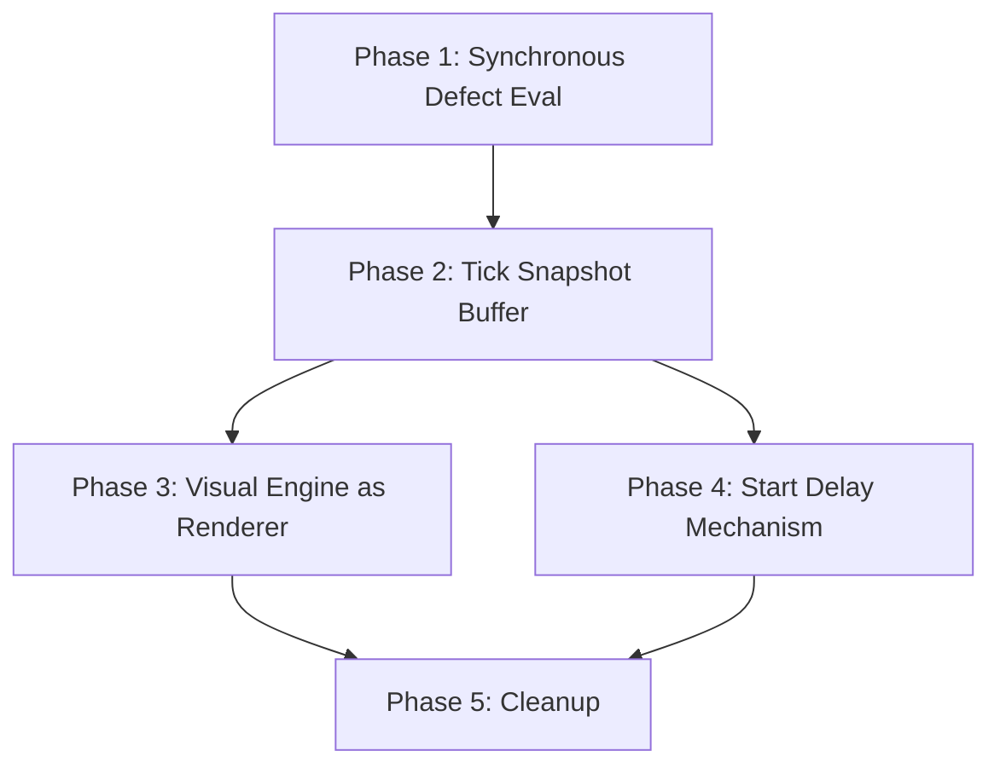

# Simulate-Ahead Architecture Migration Plan

> **Status**: Planned  
> **Author**: Generated from analysis of quality-count divergence bugs  
> **Date**: 2026-03-04  
> **Priority**: High — addresses the root cause of every data-consistency bug between the visual layer and data layer

---

## 1. Problem Statement

The Virtual Factory has **two independent engines** running in parallel:

| Engine            | Store                           | Responsibilities                                                                                               |
| ----------------- | ------------------------------- | -------------------------------------------------------------------------------------------------------------- |
| **Visual Engine** | `simulationStore` (Zustand)     | 3D tile animation, ConveyorBelt routing, visual counters (`shipmentCount`, `wasteCount`, `secondQualityCount`) |
| **Data Engine**   | `simulationDataStore` (Zustand) | Tile lifecycle, quality grading, OEE calculations, Supabase sync, CWF queries                                  |

These engines make **independent decisions** about the same events (tile grading, defect detection, quality classification). Because they run at different timings (visual engine in `requestAnimationFrame`, data engine in `moveTilesOnConveyor` + deferred microtasks), their state **inevitably diverges**.

### Bugs Caused by This Architecture

| Bug                                                      | Root Cause                                                         |
| -------------------------------------------------------- | ------------------------------------------------------------------ |
| FTQ counter inflation (344 vs 316)                       | `totalFirstQuality` incremented before microtask defect evaluation |
| 3D boxes vs CWF disagreement (30/42/86 vs 28/89/41)      | Visual counters and data counters are completely independent       |
| `production_metrics.second_quality_count = 0`            | Period metrics finalized before microtask corrects grades          |
| Bridge hacks (`scrappedPartIds`, `secondQualityPartIds`) | Needed because visual engine can't read from data engine directly  |
| Drain sweep regrading                                    | Catches tiles whose grades were wrong during normal simulation     |

All of these are **symptoms of the dual-engine architecture**.

---

## 2. Target Architecture: Simulate-Ahead, Render-Behind

### Core Principle

> **The data engine runs N ticks ahead of the visual engine. The visual engine is a pure renderer that replays data engine state.**

```
Timeline:
  Data Engine:   [Tick 10] [Tick 11] [Tick 12] [Tick 13] [Tick 14]
  Visual Engine:                     [Tick 10] [Tick 11] [Tick 12]
                                      ↑ reads from data engine's
                                        completed state for tick 10
```

### Benefits

1. **Single source of truth**: Only the data engine makes decisions (defects, grades, routing)
2. **Eliminates all bridge sets**: Visual engine reads tile.final_grade directly
3. **Eliminates microtask timing hacks**: Data engine runs synchronously per tick
4. **CWF, DTXFR, Basic panel, OEE table, 3D scene all agree**: Same store, same data
5. **Realistic**: This is how real SCADA/MES digital twin systems work

---

## 3. Key Design Decisions

### 3.1 Tick Buffer Size

The visual engine needs a **buffer of completed ticks** to read from. The buffer size determines the visual delay:

```typescript
// In params.ts
/** Number of ticks the data engine runs ahead of the visual engine. */
export const SIMULATE_AHEAD_TICKS = 10; // ~1 second at 10 ticks/sec
```

**Recommendation**: 10 ticks (1 second at current speed). This is:

- Large enough for all defect evaluation to complete synchronously
- Small enough that the visual delay is imperceptible

### 3.2 Tick State Snapshot

Each tick produces a **snapshot** that the visual engine reads:

```typescript
interface TickSnapshot {
  /** Simulation tick this snapshot represents. */
  tick: number;
  /** Tiles created at this tick (press station spawn). */
  tilesCreated: Array<{
    tileId: string;
    tileNumber: number;
  }>;
  /** Tile movements that happened at this tick. */
  movements: Array<{
    tileId: string;
    fromStation: StationName;
    toStation: StationName;
  }>;
  /** Tiles that completed the line at this tick, with final grade. */
  completions: Array<{
    tileId: string;
    tileNumber: number;
    finalGrade: QualityGrade;
    /** Which visual destination: 'shipment', 'secondQuality', 'wasteBin'. */
    destination: "shipment" | "secondQuality" | "wasteBin";
  }>;
  /** Tiles scrapped mid-line at this tick. */
  scraps: Array<{
    tileId: string;
    tileNumber: number;
    station: StationName;
    defectTypes: string[];
  }>;
  /** Current quality counters at this tick. */
  counters: {
    totalProduced: number;
    firstQuality: number;
    secondQuality: number;
    scrapGraded: number;
    onBelt: number;
  };
}
```

### 3.3 Ring Buffer for Snapshots

```typescript
/** Circular buffer of tick snapshots. */
const SNAPSHOT_BUFFER_SIZE = SIMULATE_AHEAD_TICKS * 2; // 20 slots

interface SimulateAheadBuffer {
  /** Ring buffer of completed tick snapshots. */
  snapshots: TickSnapshot[];
  /** Head index: next slot the data engine will write to. */
  writeHead: number;
  /** Tail index: next slot the visual engine will read from. */
  readHead: number;
  /** Data engine's current tick (ahead). */
  dataEngineTick: number;
  /** Visual engine's current tick (behind). */
  visualEngineTick: number;
}
```

---

## 4. Migration Phases

### Phase 1: Data Engine Synchronous Defect Evaluation

**Goal**: Remove the microtask hack. Make defect evaluation synchronous within `moveTilesOnConveyor`.

**Changes**:

- Move `evaluateStationDefects()` call from the microtask (line ~548-616 in `tileSlice.ts`) into the synchronous `set()` callback
- The challenge is `recordTileSnapshot()` calling `set()` inside another `set()`. Fix by accumulating snapshots in a local array and writing them in the same `set()` call
- Remove `queueMicrotask()` entirely
- Remove bridge sets (`scrappedPartIds`, `secondQualityPartIds`)

**Files**: `src/store/slices/tileSlice.ts`

**Risk**: Medium — this is the core simulation loop  
**Testing**: All existing tests + new integration tests for concurrent grade + snapshot recording

---

### Phase 2: Tick Snapshot Buffer

**Goal**: Data engine produces `TickSnapshot` objects instead of directly modifying visual state.

**Changes**:

- Add `TickSnapshot` type to `src/store/types.ts`
- Add `SimulateAheadBuffer` to the data store
- Modify `tick()` in `simulationDataStore.ts` to write a snapshot after each tick
- Add `SIMULATE_AHEAD_TICKS` and `SNAPSHOT_BUFFER_SIZE` to `src/lib/params/simulation.ts`

**Files**: `src/store/types.ts`, `src/store/simulationDataStore.ts`, `src/lib/params/simulation.ts`

**Risk**: Low — additive, doesn't change existing behavior yet

---

### Phase 3: Visual Engine as Pure Renderer

**Goal**: ConveyorBelt reads from the snapshot buffer instead of making independent decisions.

**Changes**:

- `ConveyorBelt.tsx` reads the next `TickSnapshot` from the buffer each frame
- Tile spawning: reads `snapshot.tilesCreated` → creates 3D mesh
- Tile movement: reads `snapshot.movements` → animates mesh between stations
- Tile completion: reads `snapshot.completions` → animate to `destination` (shipment/secondQuality/wasteBin)
- Remove ALL bridge-reading code (`defectedPartIds`, `scrappedPartIds`, `secondQualityPartIds`)
- Remove ConveyorBelt's independent defect detection logic

**Files**: `src/components/factory/ConveyorBelt.tsx`

**Risk**: High — largest file in the project (~1500 lines), core rendering loop  
**Testing**: Manual visual verification + automated snapshot replay tests

---

### Phase 4: Start Delay Mechanism

**Goal**: When user presses "Start", data engine begins immediately but visual engine waits `SIMULATE_AHEAD_TICKS` frames before starting playback.

**Changes**:

- `SimulationRunner.tsx`: on start, kick off data engine immediately
- After `SIMULATE_AHEAD_TICKS` frames, start reading from snapshot buffer for visual rendering
- Pause/resume: both engines pause/resume, maintaining the offset
- Speed changes: both engines adjust speed, buffer absorbs the transition

**Files**: `src/components/SimulationRunner.tsx`

**Risk**: Low — mostly orchestration logic

---

### Phase 5: Cleanup

**Goal**: Remove all dead code from the dual-engine era.

**Changes**:

- Remove visual counters from `simulationStore`: `shipmentCount`, `wasteCount`, `secondQualityCount`, `defectedPartIds`, `scrappedPartIds`, `secondQualityPartIds`
- Remove their increment/decrement actions
- Remove all bridge-related code in ConveyorBelt
- Remove drain sweep's bridge fallback logic (no longer needed)
- Update all tests

**Files**: `src/store/simulationStore.ts`, `src/store/slices/tileSlice.ts`, `src/components/factory/ConveyorBelt.tsx`, tests

**Risk**: Medium — widespread changes but purely deletional

---

## 5. Migration Order & Dependencies



**Estimated effort per phase**:

- Phase 1: 2-3 hours (medium complexity, core loop)
- Phase 2: 1-2 hours (new types + buffer, additive)
- Phase 3: 4-6 hours (ConveyorBelt rewrite, highest risk)
- Phase 4: 1-2 hours (orchestration)
- Phase 5: 1-2 hours (deletion + test updates)

**Total**: ~10-15 hours across 2-3 sessions

---

## 6. Rollback Strategy

Each phase is independently deployable:

- **Phase 1** can be merged alone (improves grading accuracy without changing visual behavior)
- **Phases 2-4** must be deployed together (buffer + renderer + delay)
- **Phase 5** is cleanup, can be deferred

If Phase 3 causes visual regressions, we can revert to the tactical fix (current state) by reverting Phase 3 and keeping Phases 1-2.

---

## 7. Testing Strategy

### Per-Phase Tests

| Phase | Test Type   | What                                                             |
| ----- | ----------- | ---------------------------------------------------------------- |
| 1     | Unit        | Tile grade assigned synchronously with correct defect evaluation |
| 2     | Unit        | Ring buffer write/read, overflow handling                        |
| 3     | Integration | Snapshot replay produces correct visual destinations             |
| 4     | Integration | Start delay, pause/resume offset maintenance                     |
| 5     | Regression  | Full test suite, no visual counter references remain             |

### Acceptance Criteria

- [ ] 3D box numbers match CWF query results exactly at any tick
- [ ] `production_metrics.second_quality_count` is non-zero when second quality tiles exist
- [ ] No bridge sets remain in the codebase
- [ ] Visual delay is imperceptible to the user (≤ 1 second)
- [ ] All 763+ existing tests pass
- [ ] New tests cover snapshot buffer and replay logic

---

## 8. Configuration Parameters

All timing constants should be added to `src/lib/params/simulation.ts`:

```typescript
/** Number of ticks the data engine runs ahead of the visual engine. */
export const SIMULATE_AHEAD_TICKS = 10;

/** Ring buffer size for tick snapshots (2× ahead ticks for safety). */
export const SNAPSHOT_BUFFER_SIZE = SIMULATE_AHEAD_TICKS * 2;

/** Minimum buffered ticks before visual engine starts playback. */
export const MIN_BUFFERED_BEFORE_PLAY = SIMULATE_AHEAD_TICKS;
```
